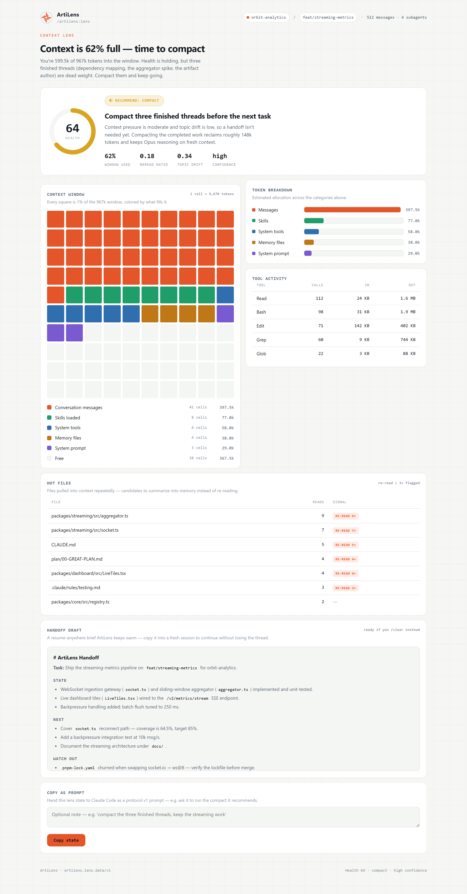
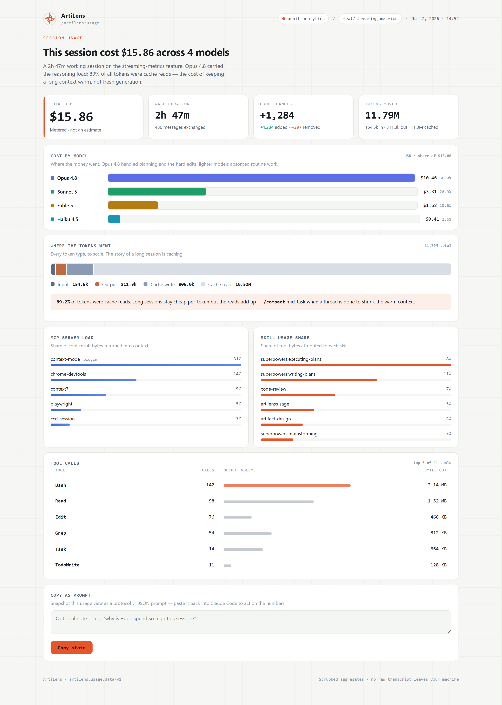
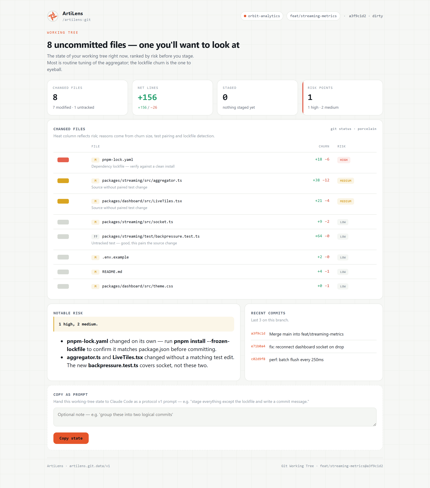
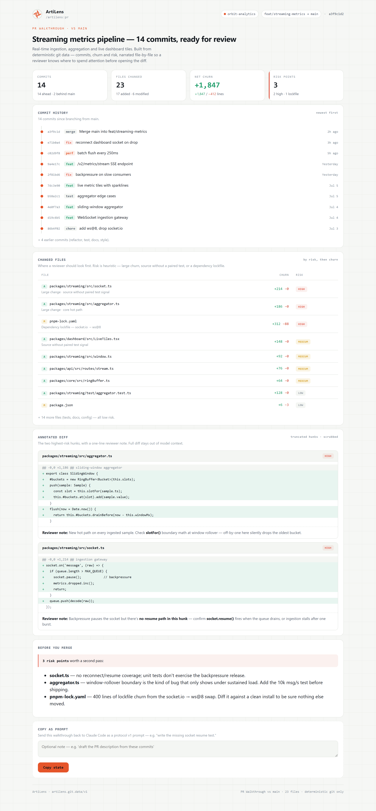
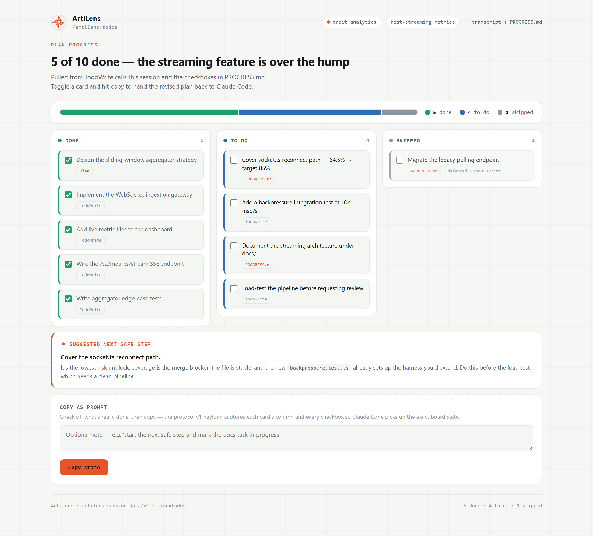
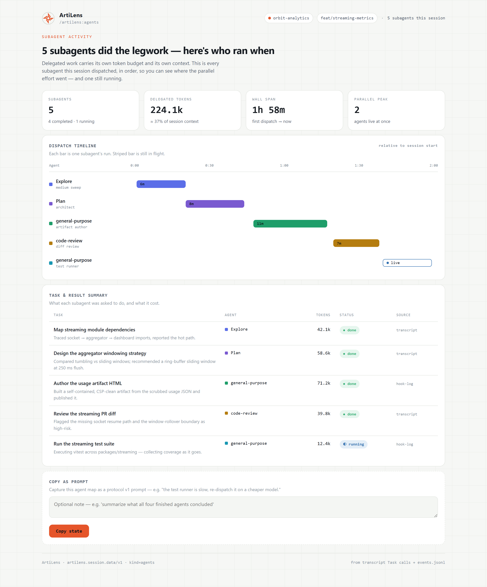
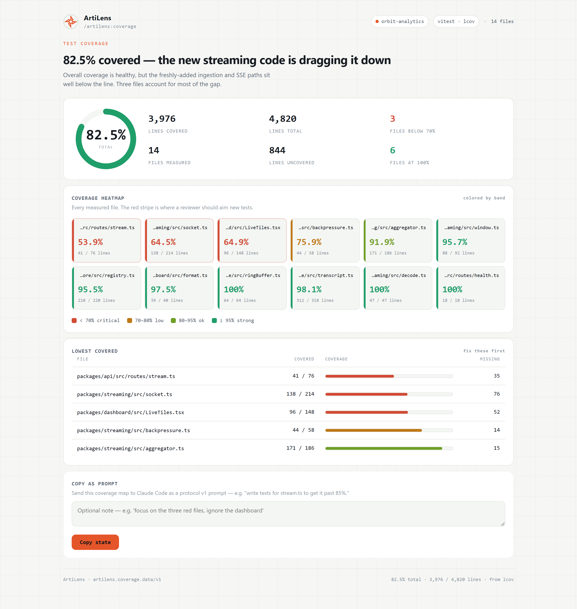
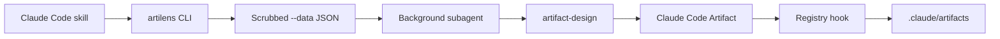

<p align="center">
  
</p>

<h1 align="center">See Your Claude Code Work as Living Artifacts</h1>

<p align="center">
  <strong><em>Scrubbed data in. Native artifacts out. Keep them in your repo.</em></strong>
</p>

<p align="center">
  
</p>

ArtiLens is a Claude Code companion toolkit for turning session context, repo state,
review data, docs health, todos, and workflow notes into polished Claude Code
Artifacts.

## Quick Install

```bash
claude plugin marketplace add ./
claude plugin install artilens@artilens-marketplace
```

## Why Developers Use It

- **Understand the session**: context pressure, token spread, tool usage, hot files,
  and handoff readiness.
- **Review the repo faster**: git status, commits, PR walkthroughs, and coverage data
  become visual artifacts instead of terminal walls.
- **Keep artifacts durable**: every publish is versioned locally with metadata and
  git context.
- **Steer from the UI**: Claude Code artifacts are normally stateless; copy-as-prompt
  turns artifact state, notes, and selected changes into a model-steering prompt for
  the active session.
- **Extend the surface**: today's skills are only the first set. Any future skill can
  collect scrubbed data, pass a short page plan, and let native artifact authoring
  visualize it.

## Artifact Views

<table>
  <tr>
    <td width="50%">
      
      <br />
      <strong>Context Lens</strong>
      <br />
      Session health, context usage, tool pressure, hot files, and handoff signals.
    </td>
    <td width="50%">
      
      <br />
      <strong>Usage Lens</strong>
      <br />
      Session cost, model token distribution, MCP and skill usage, and line-change estimates.
    </td>
  </tr>
  <tr>
    <td width="50%">
      
      <br />
      <strong>Git View</strong>
      <br />
      Branch state, changed files, churn, and risk notes from scrubbed git data.
    </td>
    <td width="50%">
      
      <br />
      <strong>PR Walkthrough</strong>
      <br />
      Commit narrative, changed-file tour, trimmed hunks, and reviewer-facing context.
    </td>
  </tr>
  <tr>
    <td width="50%">
      
      <br />
      <strong>Todos</strong>
      <br />
      Work state, blocked items, next actions, and copy-as-prompt feedback.
    </td>
    <td width="50%">
      
      <br />
      <strong>Agents</strong>
      <br />
      Subagent timelines, task summaries, outcomes, and coordination history.
    </td>
  </tr>
  <tr>
    <td width="50%">
      
      <br />
      <strong>Coverage</strong>
      <br />
      LCOV, Vitest JSON, or Cobertura coverage data shaped for artifact authoring.
    </td>
    <td width="50%">
      
      <br />
      <strong>More Skills</strong>
      <br />
      Docs health, commands, context files, boards, incidents, releases, dependency reviews,
      and whatever your next skill needs to visualize.
    </td>
  </tr>
</table>

## Current Skills

ArtiLens ships Claude Code skills for:

- `lens`, `usage`, `git`, `pr`
- `agents`, `todos`, `context-files`, `commands`
- `docs-health`
- `board`, `compare`, `incident`, `release`, `deps`
- `artifacts` for registry browsing and version diffs

The important part is the pattern, not the fixed list. A new skill does not need to
build a renderer. It only needs trustworthy data, a compact page plan, and the
native artifact authoring handoff.

## How It Works



The CLI is intentionally boring: collect, scrub, summarize, write JSON. Visual design
belongs to the native `artifact-design` skill, guided by
`plugin/references/artifact-authoring.md`.

The runtime pattern is:

1. The `artilens` CLI emits scrubbed `--data` JSON from the current project/session.
2. A skill dispatches a background subagent.
3. The subagent loads `artifact-design` and authors the HTML artifact.
4. The registry hook captures the published artifact into `.claude/artifacts/`.

No MCP server. No CLI-rendered dashboard path. No external resources in artifact HTML.

## Install for Local Development

```bash
pnpm install
pnpm check
```

Then use the skills from Claude Code:

```text
/artilens:lens
/artilens:usage
/artilens:git
/artilens:todos
/artilens:docs-health
```

## CLI Data Mode

During development, you can generate the same scrubbed data directly:

```bash
pnpm cli -- lens --session fixtures/transcripts/simple.jsonl --data .claude/artilens/lens.data.json
pnpm cli -- usage --data .claude/artilens/usage.data.json
pnpm cli -- git status --data .claude/artilens/git-status.data.json
pnpm cli -- git pr --base main --data .claude/artilens/pr.data.json
pnpm cli -- coverage --from fixtures/coverage.lcov --data .claude/artilens/coverage.data.json
pnpm cli -- docs-health --data .claude/artilens/docs-health.data.json
```

CLI output stays quiet: a data path plus a short summary. It does not dump raw
transcripts, full diffs, or raw coverage files to stdout.

## Safety Model

- Artifact HTML is self-contained.
- No external scripts, stylesheets, fonts, images, iframes, fetch, or remote imports.
- Skills pass scrubbed data paths, not raw transcripts.
- Hooks are Node-based for Windows and Unix compatibility.
- ArtiLens does not ship an MCP server.
